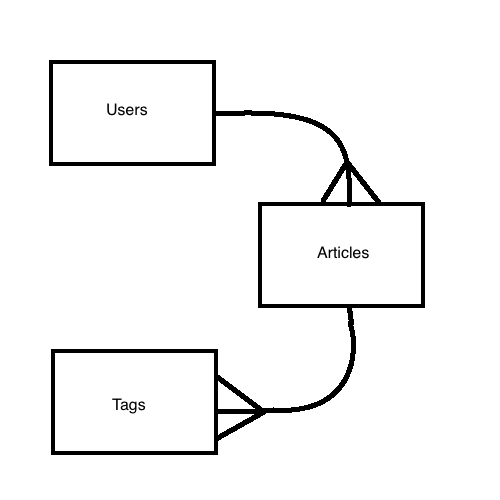

# Performance Talk
## Common Refactorings


## Part 1: Reviewing Model Relationships

### Phase 1: Finding A Plan


Let's review our `db/schema.rb` to recall our current db models.

```
"articles", force: true do |t|
    t.string   "title"
    t.text     "content"
    t.datetime "created_at"
    t.datetime "updated_at"
    t.integer  "user_id"
  end

  create_table "tags", force: true do |t|
    t.text     "text"
    t.datetime "created_at"
    t.datetime "updated_at"
    t.integer  "article_id"
  end

  create_table "users", force: true do |t|
    t.string   "email"
    t.string   "first_name"
    t.string   "last_name"
    t.string   "password_digest"
    t.datetime "created_at"
    t.datetime "updated_at"
  end
  create_table "articles", force: true do |t|
    t.string   "title"
    t.text     "content"
    t.datetime "created_at"
    t.datetime "updated_at"
    t.integer  "user_id"
  end

  create_table "tags", force: true do |t|
    t.text     "text"
    t.datetime "created_at"
    t.datetime "updated_at"
    t.integer  "article_id"
  end

  create_table "users", force: true do |t|
    t.string   "email"
    t.string   "first_name"
    t.string   "last_name"
    t.string   "password_digest"
    t.datetime "created_at"
    t.datetime "updated_at"
  end
  create_table "articles", force: true do |t|
    t.string   "title"
    t.text     "content"
    t.datetime "created_at"
    t.datetime "updated_at"
    t.integer  "user_id"
  end

  create_table "tags", force: true do |t|
    t.text     "text"
    t.datetime "created_at"
    t.datetime "updated_at"
    t.integer  "article_id"
  end

  create_table "users", force: true do |t|
    t.string   "email"
    t.string   "first_name"
    t.string   "last_name"
    t.string   "password_digest"
    t.datetime "created_at"
    t.datetime "updated_at"
  end
```

### Question

* How would this look when represented as an ERD?

### ANSWER




We want to search for areas of duplication where we are inefficiently storing data.

### Question 

* Is it possible to have multiple articles in our application that have the same `tags`?

### Answer

> Yes! 

We The best thing to do would be to refactor this simple `has_many` relationship using an `M:N` association, `many_to_many`, and taking advantage of a join table to store related tags.


### Question

* What would our refactored `ERD` look like?

### ANSWER

> [see here](images/model_erd_refactor.png)

### Question

* What information would our `ArticleTags` model store and what possible refactorings might we have to apply to the `Tag` model?

### ANSWER

* The `ArticleTag` model only needs to `foriegn_keys`: `article_id` and `tag_id`.
* The `Tag` model needs a migration to `RemoveArticleIdFromTags`.


## Phase 2: Implememting A Plan

* Generate an `ArticleTag` model with the appropriate attributes.
* Generate a migration to remove the `foriegn_key` from the `tags` table.
* Edit the `article`, `article_tag`, and `tag` models to reflect the new `has_many` through relationship
  * Be sure to remove any old `belongs_to` and `has_many` statements.


